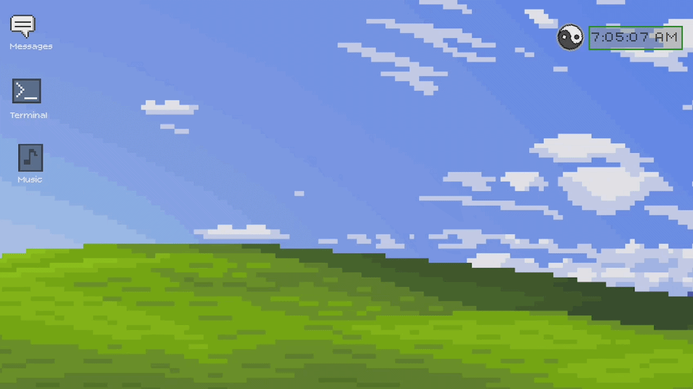
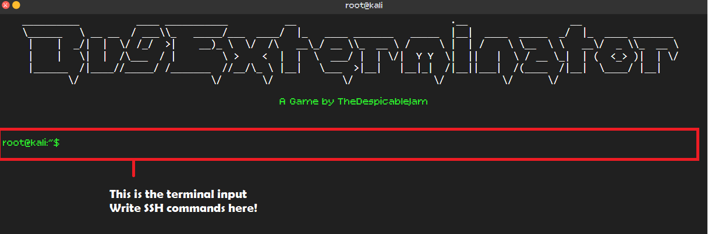
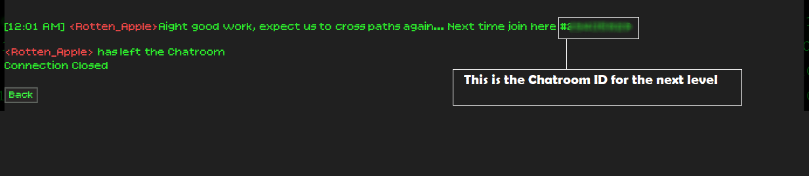
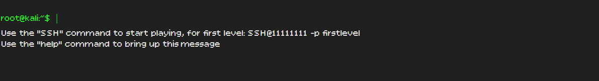

# BugHouse
## Introduction
> *"When nothing happens, they question our pay"*
>
> *"When something happens, they question why we get paid"*
>
> *"We... are cybersecurity specialists..."*

Cybersecurity is one those fields where you just can't get good without real world practice...
but let's be honest, cybersecurity is also one those fields where real world practice can get you in some serious trouble.

I love hacking! but as a beginner cybersec can get pretty ruthless...

So why not gamify it?

## Gamifying Cybersecurity

BugHouse [or project BugExterminator] provides a gamified version for web exploitation in a safe and legal environment, with a CTF style gameplay with a lore filled story!

## How to Play

This game is a CTF! so I cannot really disclose all the methods used to play the game, but here is the most repeated thing you will do while playing, choosing a challenge to play. 
This is the main screen to select a level here you will find a input field where you can enter commands to select a level. 
Following the cybersecurity theme, you enter fake ssh commands to play the game.

### SSH commands
The game follows this syntax for the SSH commands to select a level **SSH@[ ROOM ID ] -p [ ADMIN TOKEN FOUND IN PREVIOUS LEVEL ]** 
**ROOM ID -** You enter the ID of the room you want to play, the first room's ID is 11111111 
**ADMIN TOKEN -** Here you enter the Admin token you found in the previous level, to access the first room you just type "firstlevel" in this place

**IMPORTANT:** remember the "-p" is important!

So to play the first level you just need to type, **SSH@11111111 -p firstlevel** in the terminal input

After entering the correct admin token and completing the level, you will get the next level's Chatroom ID, to write in the next SSH command

**help and SSH:** Incase you forget how to write the command, just type help in the terminal input and you will get a help message instructing you about the syntax

## Caution SPOILERS AHEAD!

Incase you want to jump to specific levels skipping earlier ones here are all the SSH commands (thank me later)

| Levels        | SSH           |
| ------------- |:-------------:|
| challenge 1 | SSH@11111111 -p firstlevel|
| challenge 2 | SSH@29405828 -p jackbirkman|
| challenge 3 | SSH@37502750 -p youspace    |
| challenge 4 | SSH@47851606 -p privaterepos |
| challenge 5 | hehe I wont spoil this one |

## Tech Stack

BugHouse is a webapp running [Flask](https://flask.palletsprojects.com/en/stable/) and Python in the backend, and uses HTML, JavaScript, and CSS in the frontend

It is hosted through [Vercel](https://vercel.com) and can be accessed on [BugHouse](https://bug-house.vercel.app/)

## AI Declaration
I only used a minor amount of AI in this projecet, notably in the Ad generation system, and in the Rescaling wrapper for the screen, which were mostly made by me.